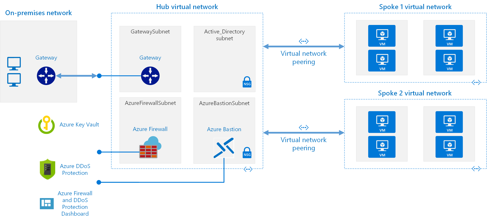

# Hub and Spoke Network Topology

## What is it?

A Hub and spoke topology is a networking model for more efficient management of common communication or security requirements. This arrangement also helps avoid Azure subscription limitations. This hub and spoke model addresses the following concerns:

- **Cost savings and management efficiency**. Multiple workloads, such as network virtual appliances (NVAs) and DNS servers, can share centralized services in a single location. This approach enables IT departments to minimize redundant resources and management effort.
- **Overcoming subscriptions limits**. Large cloud-based workloads might require the use of more resources than a single Azure subscription allows. Arranging virtual network workloads on a peer-to-peer basis from different subscriptions to a central hub can overcome these limits. For more information, see [Azure subscription limits](https://docs.microsoft.com/azure/azure-resource-manager/management/azure-subscription-service-limits).
- **Separation of concerns**. You can deploy individual workloads between Central IT teams and workload teams.

Note that smaller cloud environments might not benefit from the added capabilities that this model offers. However, if you are designing a larger cloud-based environment, you should consider implementing a hub and spoke networking architecture if you have any of the concerns in the previous list.

## Why do you need it?

The Hub and Spoke model enables you to achieve the following outcomes:

- Provide a best practice architecture for a secure, reliable, and scalable solution in Azure
- Separate security zones between applications (spokes) and shared services (hub)
- Support multiple applications and security zones between spokes

## What are the potential use cases?

You can use the hub and spoke model for greenfield deployments with PoCs or when building a development or production environment. This architecture can also serve as a foundation on which you can run other scripts in this repository to build media solutions.

## What are the technology components and/or solution?

The following example demonstrates a landing zone in Azure with a Hub that includes:

- VPN Gateway
- Azure Firewall
- Azure Bastion (Optional)
- Active Directory (Optional)

  

## Access to the Source Repository

Please go to this repository for pre-defined Terraform deployment scripts to create this architecture:

### [caf-terraform-landing-zones](https://github.com/Azure/caf-terraform-landingzones/tree/master/landingzones/landingzone_hub_spoke)
