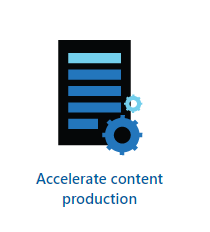
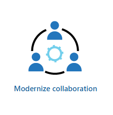
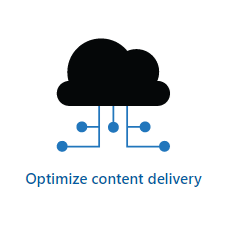
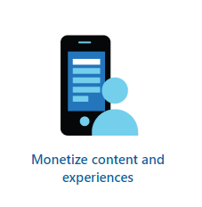

# Microsoft Azure Media and Entertainment

The demand for visual entertainment such as feature films and mini-series on big or small screen continues to grow, with modern audiences expecting more spectacular and realistic visual effects with each release. In consequence, visual effects teams need more computing power with every passing year. Simultaneously, editors demand greater control over textures and color grading, while producers must minimize costs, while meeting demanding release timescales.

With post-production processing accounting for up to 30% of a film's eventual budget, studios and production companies are increasingly turning away from on-premises computing power. Racks of servers in render farms represent a significant capital investment that smaller, independent production companies cannot afford;  even larger studios may not have the throughput to utilize those resources fully.

[Microsoft Azure Media and Entertainment](https://www.microsoft.com/industry/media-entertainment) (M&E) technologies provide scalable, cloud-based post-production processing (PPP) facilities that enable you to access the resources you need to deliver your M&E project on time and within budget.

  
  
  
  
  

The M&E team created this repository with links to resources, code and implementation guidance that enables everyone involved in bringing a production to the screen to incorporate Microsoft Azure into their PPP delivery stream.

## Aim

The aim of this repository is to provide a definitive content resource that facilitates the implementation of post-production processing technologies, workloads, and services on Microsoft Azure.

This resource provides customers, partners, and Microsoft architects with tools, resources, and scripts to deploy common Media and Entertainment solutions into a Microsoft Azure environment. These deployments can be either new (greenfield) or part of a pre-existing (brownfield) implementations, whether as an initial Proof of Concept project or as the starting point of a full production solution.

This repository is the main hub for M&E content that Microsoft and our partners publish. We will keep this material current and add new assets regularly to support common M&E workflows and solutions. Microsoft and our partners [welcome your feedback](mailto:gitme@microsoft.com) for any scenarios that we have not covered.

## Audience

This content addresses multiple audiences, both within and outside the media production industry. These audiences include:

- Studios
- Production companies
- Producers, editors, and directors
- Visual Effects creators
- Independent filmmakers

To ensure that these industry-specific roles can implement M&E technologies on Microsoft Azure, the content also addresses the following technical roles:

- Microsoft field personnel responsible for implementing Azure M&E technologies
- Partners working with M&E groups to deliver productions
- Software integrators developing industry-specific solutions on Microsoft Azure

## Table of Contents

Microsoft Azure M&E technologies provide support for the entire media creation through post-production process:

- **[Foundation](/Foundation)** : Content focused on the landing zone for media asset resources if you do not have one already
    - [Hub/Spoke Hybrid Network](/Foundation/hubspoke-architecture) : Create a hub/spoke network with VPN back to on-premise

- **[Ingest](/Ingest)** : Content Focused on getting media assets into an Azure media pipeline
    - [Signiant ingest pipeline](/Ingest/signiant) : Ingest pipeline utilizing Signiant's technology
    - [Aspera Ingest pipeline](/Ingest/aspera) : Ingest pipeline utilizing Aspera's technology
    - [Simple Ingest](/Ingest/simple-ingest) : Examples of ways to ingest with cloud native tooling
 
- **[Create](/Create)** : Content focused on creating, transforming or transcoding media assets
    - [Avere Rendering](/Create/avere-rendering) : Render content utilizing Azure HPC
    - [Video to Gif Converter](/Create/video-gif-converter) : Convert mp4 videos to gif's using an Azure Function
    - [Remote Editing Workstation](/Create/remote-edit-workstation) : Scripts to deploy a Virtual Machine optimized to run editing software such as Adobe Photoshop, Adobe Premiere, or BlackMagic Resolve.
    - [Intelligent Metadata Generation](/Create/intelligent-metadata-generator) : Generate intelligent insights about video files and extract JSON output utilizing a Video Indexer workflow

- **[Manage](/Manage)** : Content focused on managing media assets such as DAMs and MAMs
    - [Avid Media Central](/Manage/avid-media-central) : Deploy Avid's Media Central for managing media assets

- **[Distribute](/Distribute)** : Content focused on moving media assets out of Azure into production

- **[Monetize](/Monetize)** : Content focused on monetizing media production such as advertising
    - [Intelligent Metadata Generation](/Monetize/intelligent-metadata-generate) : Generate intelligent insights about video files that support metadata tags advertisers look for.
    
- **[M&E Solutions](/Solutions)** : End to End solutions utilizing integrations of multiple products
    - [PowerApps Ingest Pipeline](/Solutions/powerapp) : Ingest pipeline using PowerApps automation and Azure serverless and partner solutions
    - [Avid Editorial Pipeline](/Solutions/avid-editorial-pipeline) : Deploy an end to end solution for ingesting content, managing media assets and editing content through Avid.

## Contents

For each Media and Entertainment technology, each repository provides details on the following:

- What are the technology components and/or solution?
- Why do you need it?
- What are the potential use cases?
- Link to the code repository.

By taking this approach, we aim to inform both those within the M&E industry and technical personnel responsible for incorporating each technology.

## Contact Us

We would love to hear from you. Whether you would like to feature your repository on this site, you have feedback to improve this material, or recommendations for new scenarios, please [reach out to us](mailto:gitme@microsoft.com).
